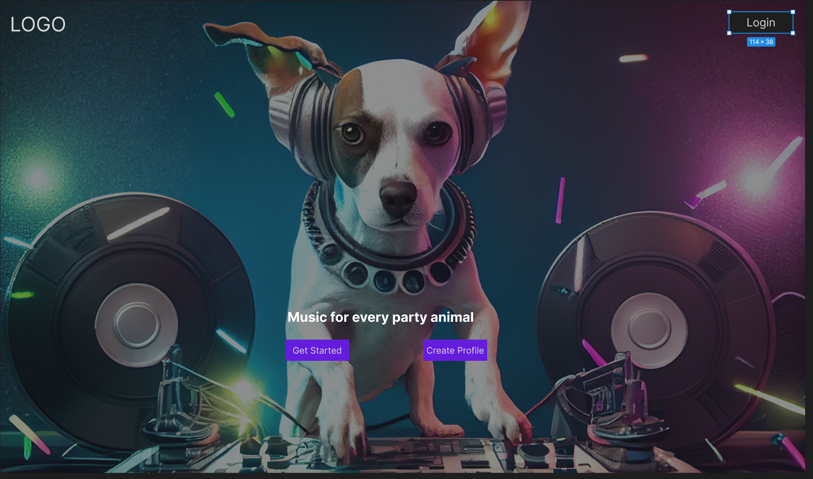
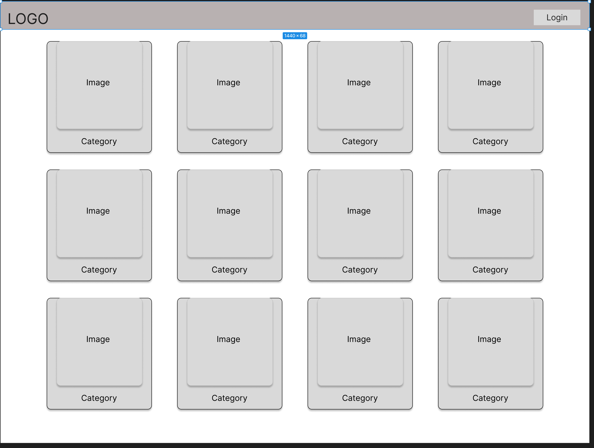
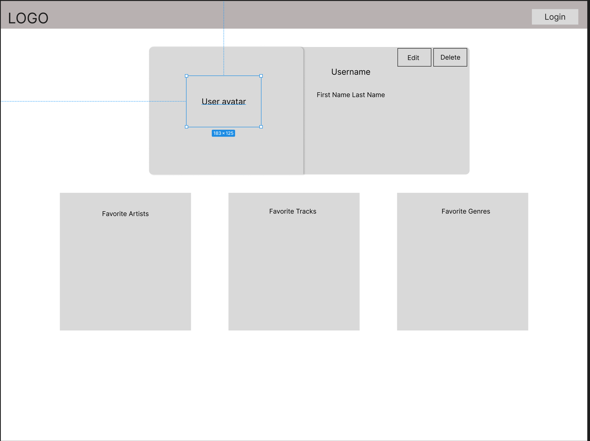
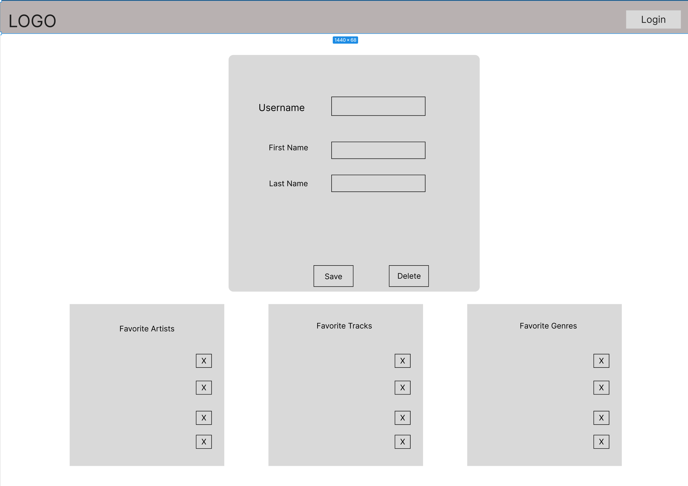
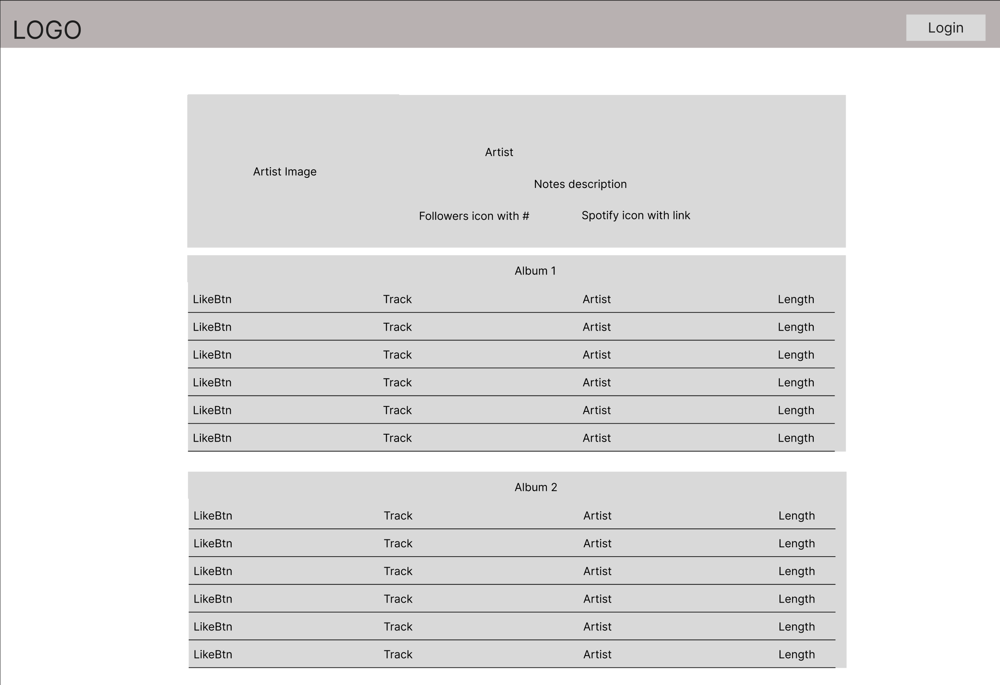
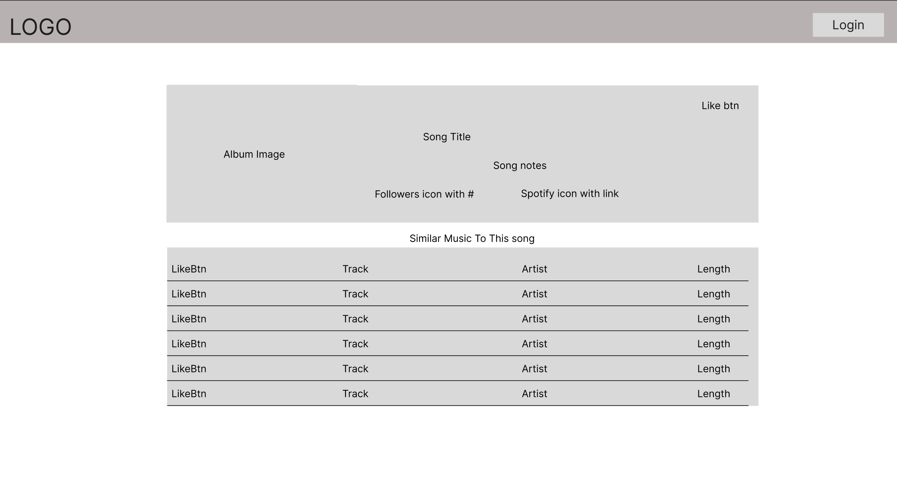
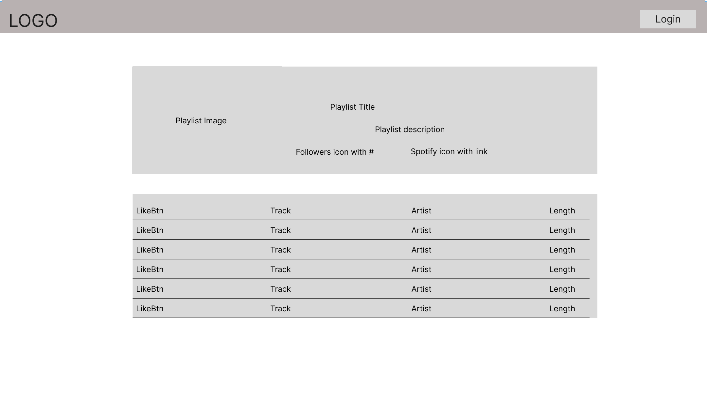
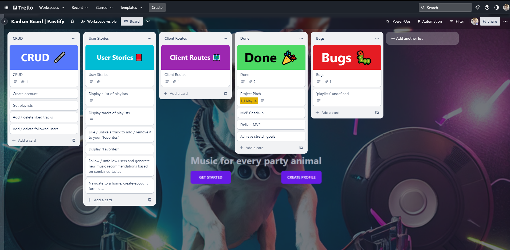

#pawtify starter

# Phase 2 Lecture Project Pitch Example

## [Wireframes](https://www.figma.com/file/EiEpomnCYh7AGbhqc2p3pk/Phase-2-Portfolio-Demo?type=design&node-id=0%3A1&t=YvzclA1k0MT8cjhW-1)

Index


Home


Profile View


Profile Edit


Artist


Track


Playlist-Album-View


---

## User Stories

- User will be able to...

1. View available music beginning with a category view
2. View single category/playlist/track/album/artist
3. Like a track/artist/genre
4. Create a profile
5. Edit their profile
6. Save the liked items to their profile
7. Get recommendations generated by their favorite items
8. Delete their profile

---

## React Tree

---

## [API Routes](https://documenter.getpostman.com/view/26331028/2s93Y3uLLX)

| API Route(External) | Requested Method | Header                           | Response            |
| ------------------- | ---------------- | -------------------------------- | ------------------- |
| /artists            | GET              | Authorization: Basic+AccessToken | [{...},{...},{...}] |
| /browse/categories  | GET              | Authorization: Basic+AccessToken | [{...},{...}.{...}] |
| /artists/:id        | GET              | Authorization: Basic+AccessToken | [{...}]             |
| /tracks/:id         | GET              | Authorization: Basic+AccessToken | [{...}]             |
| /albums/:id         | GET              | Authorization: Basic+AccessToken | [{...}]             |
| /categories/:id     | GET              | Authorization: Basic+AccessToken | [{...}]             |
| /playlists/:id      | GET              | Authorization: Basic+AccessToken | [{...},{...}.{...}] |

---

## Client Side Routes

| Client Route         | Component           |
| -------------------- | ------------------- |
| /                    | Root.jsx->Index.jsx |
| /home                | Home.jsx            |
| /profile/:id         | Action => edit.jsx  |
| /profile/:id/edit    | edit.jsx            |
| /profile/:id/destroy | destroy.jsx         |
| /artists             | Artists.jsx         |
| /artists/:id         | Artist.jsx          |
| /categories/:id      | Categories.jsx      |
| /categories          | Home.jsx            |
| /tracks/:id          | Track.jsx           |
| /albums/:id          | Album.jsx           |
| /playlists/:id       | Playlist.jsx        |

---

## Trello



## Description

Project Name: Pawtify

Tagline: Music for every party animal

Concept: You and your friends are together and want something to listen to, but you aren't sure what will fit all your musical tastes...enter Pawtify

Premise: Social media site for music recommendations based on combination of artists, songs, and genres among friends.

The difference factor: combinations of seeds for generation are taken from the users' selected friends at the time. (I'm with Cody, Eugene, and Ty so we can choose 2 seeds from each person and have it generate recommendations based on that combination)

## Getting Started

### Dependencies [subject to change]

- [json-server](https://www.npmjs.com/package/json-server)
- [tailwindcss](https://tailwindcss.com/)
- [postcss](https://www.npmjs.com/package/postcss)
- [autoprefixer](https://github.com/postcss/autoprefixer)
- [daisyUI](https://www.daisyui.com)
- [styled-components](https://styled-components.com/)
- [styled-icons](https://styled-icons.dev)

### Modifying the source requires the above dependencies

```
npm install
```

### Executing program

When making changes, edit the index.css file in the ./src folder only.

From the package folder run:

```
npm run server  (will start json-server on port 4000)

```

then run `npm run dev`

## Authors

- Ty Blackwell
- Cody Delzer
- Eugene Jeong
- Michael Loomis

## Version History

- 0.1
  - Initial Release

## License

This project is not licensed for any legitimate usage other than your own learning and amusement.

## Acknowledgments

Inspiration, code snippets, etc.

- [awesome-readme](https://github.com/matiassingers/awesome-readme)
